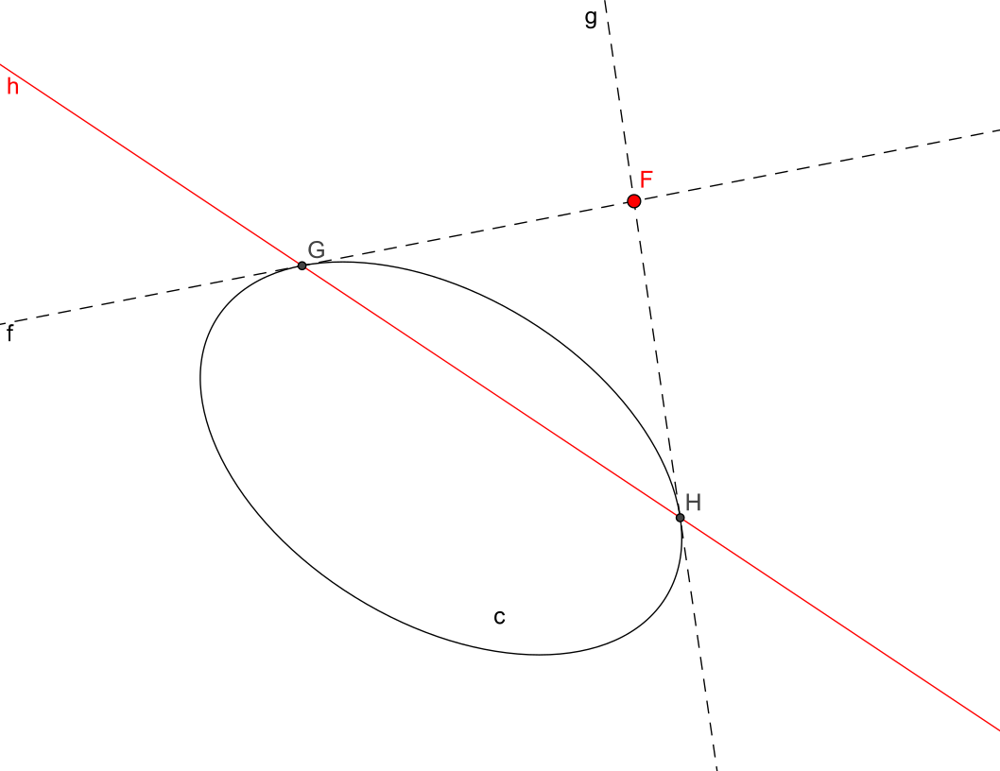
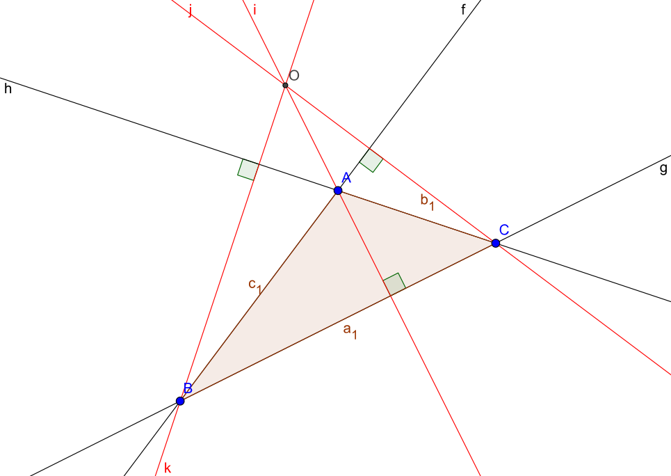
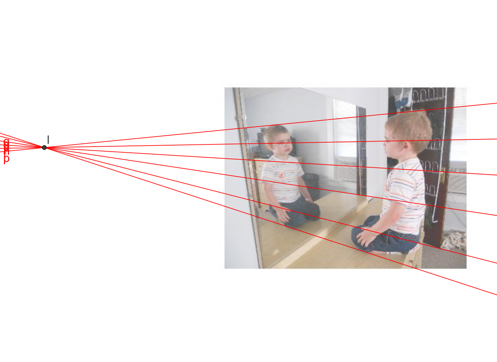

# Cayley-Klein geometry

## 👋 Introduction

### 🔑 Key points

-   The gravitational/electromagnetic force between two objects is
    inversely proportional to the square of their distance.

-   Distances and angles may be powerful for oriented measures. But
    quadrance and spread are more energy saving for non-oriented
    measures.

-   Euclidean Geometry is a degenerate case.

### Cayley-Klein Geometry

-   Projective geometry can be further categorized by polarities.

-   Except for degenerate cases, $(A^\perp)^\perp = A$ and
    $(a^\perp)^\perp = a$

-   A fundamental cone $\mathcal{F} = (\mathbf{A}, \mathbf{B})$ is
    defined by a pole/polar pair such that
    $[A^\perp] = \mathbf{A} \cdot [A]$ and
    $[a^\perp] = \mathbf{B} \cdot [a]$.

-   To visualize Cayley-Klein Geometry, we may project the objects onto
    the 2D plane.

-   In hyperbolic geometry, the projection of the fundamental cone onto
    the 2D plane is a unit circle, the so-called *null circle*. The
    distance and angle measurement can be negative outside the null
    circle.

-   We can think of Euclidean geometry as a hyperbolic geometry in which
    the null circle is expanded toward infinity.

-   In this section, we use the vector notation $p = [A]$ and $l = [a]$.

### Fundamental Cone with pole and polar

{#fig:F}

### Examples

-   Let $p = [x, y, z]$ and $l = [a, b, c]$


-   Hyperbolic geometry:

    -   $\mathbf{A} \cdot p \equiv [x, y, -z]$
    -   $\mathbf{B} \cdot l \equiv [a, b, -c]$

-   Elliptic geometry:

    -   $\mathbf{A} \cdot p \equiv [x, y, z]$
    -   $\mathbf{B} \cdot l \equiv [a, b, c]$


-   Euclidean geometry (degenerate conic):

    -   $\mathbf{A} \cdot p \equiv [0, 0, z]$
    -   $\mathbf{B} \cdot l \equiv [a, b, 0]$

-   psuedo-Euclidean geometry (degenerate conic):

    -   $\mathbf{A} \cdot p \equiv [0, 0, z]$
    -   $\mathbf{B} \cdot l \equiv [a, -b, 0]$

\]

### Examples (cont'd)

-   Perspective view of Euclidean geometry (degenerate conic):
    -   Let $l$ be the line of infinity.
    -   Let $p$ and $q$ are two complex conjugate points on $l$. Then
    -   $\mathbf{A} \equiv l \cdot l^{T}$ (outer product)
    -   $\mathbf{B} \equiv p \cdot q^{T} + q \cdot p^{T}$

### Orthogonality

-   A line $l$ is said to be perpendicular to a line $m$ if $l^\perp$
    lies on $m$, i.e., $m^\mathsf{T} \mathbf{B} l = 0$.

-   To find a perpendicular line of $l$ that passes through $p$, join
    $p$ to the pole of $l$, i.e., join($p, l^\perp$). We call this the
    *altitude* line of $l$.

-   For duality, a point $p$ is said to be perpendicular to point $q$ if
    $q^\mathsf{T} \mathbf{A} p = 0$.

-   A similar definition can be given for altitude points.

-   Note that Euclidean geometry does not have the concept of the
    perpendicular point because every $p^\perp$ is the line of infinity.

### Orthocenter of triangle

-   Theorem 1 (Orthocenter and ortholine). The altitude lines of a
    non-dual triangle meet at a unique point $O$ called the
    *orthocenter* of the triangle.

-   Despite the name "center", the orthocenter may be outside a
    triangle.

-   Theorem 2. If the orthocenter of triangle $\{ABC\}$ is $O$, then the
    orthocenter of triangle $\{OBC\}$ is $A$.

### An instance of orthocenter theorem

{#fig:orthocenter}

### An instance of Theorem 2

{#fig:orthocenter2}

### Involution

-   Involution is closely related to geometric reflection.

-   The defining property of an involution $\tau$ is that for every
    point $p$, $\tau(\tau(p)) = p$.

-   Theorem: Let $\tau$ be an involution. Then

    1.  there is a line $m$ for which $\tau(p) = p$ for every poiny $p$
        incident with $m$.
    2.  there is a point $o$ for which $\tau(l) = l$ for every line $l$
        incident with $o$.

-   We call the line $m$ the *mirror* and the point $o$ the *center* of
    the involution.

-   If $o$ is at the line of infinity (Euclidean Geometry), then we get
    an undistorted Euclidean line reflection on $m$.

-   If we choose $o = m^\perp$, then the fundamental cone is invariant.

### Involution (cont'd)

-   Theorem: The point transformation matrix $T$ of the projective
    involution $\tau$ with center $o$ and mirror $m$ is given by
    $$ (o^\mathsf{T} m) \mathrm{I} - 2 o m^\mathsf{T}$$

-   In other words, $T\cdot p$ =
    $(o^\mathsf{T} m) p - 2 (m^\mathsf{T} p) o$.

### Python Code


``` python
from proj_geom import *

def is_perpendicular(l, m):
    return m.incident(dual(l))

def altitude(p, l):
    return p * dual(l)

def orthocenter(a1, a2, a3):
    t1 = altitude(a1, a2*a3)
    t2 = altitude(a2, a1*a3)
    return t1*t2

class reflect:
    def __init__(self, m, O):
        self.m = m
        self.O = O
        self.c = dot(m, O)

    def __call__(self, p):
        return pk_point(self.c, p, -2 * dot(self.m, p), self.O)
```


### Mirror Image

{#looking-at-self}

## Basic measurement

### Quadrance and Spread for the general cases

-   Let $\Omega(x) = x \cdot x^\perp$.

-   $\Omega(A) = A \cdot A^\perp = [A]^\mathsf{T} \mathbf{A} [A]$.

-   $\Omega(a) = a \cdot a^\perp = [a]^\mathsf{T} \mathbf{B} [a]$.

-   The **quadrance** $q(A, B)$ between points $A$ and $B$ is:
    $$q(A, B) \equiv \Omega(AB) / \Omega(A) \Omega(B)$$

-   The **spread** $s(l, m)$ between lines $l$ and $m$ is
    $$s(l, m) \equiv  \Omega(lm) / \Omega(l) \Omega(m)$$

-   Note: they are invariant to any projective transformations.

### Python Code


``` python
import numpy as np
from fractions import *

def omega(l):
    return dot(l, dual(l))

def measure(a1, a2):
    omg = omega(a1*a2)
    if isinstance(omg, int):
        return Fraction(omg, omega(a1) * omega(a2))
    else:
        return omg / (omega(a1) * omega(a2))

def quadrance(a1, a2):
    return measure(a1, a2)

def spread(l1, l2):
    return measure(l1, l2)
```


### versus raditional Distance and Angle

-   Hyperbolic:
    -   $q(A, B ) = \sinh^2(d(A, B))$
    -   $s(l, m ) = \sin^2(\theta(l, m))$
-   Elliptic:
    -   $q(A, B ) = \sin^2(d(A, B))$
    -   $s(l, m ) = \sin^2(\theta(l, m))$
-   Euclidean:
    -   $q(A, B ) = d^2(A, B)$
    -   $s(l, m ) = \sin^2(\theta(l, m))$

### Measure the dispersion among points on the unit sphere


The usual way:

``` python
nsimplex, n = K.shape
maxd = 0
mind = 1000
for k in range(nsimplex):
  p = X[K[k,:],:]
  for i in range(n-1):
    for j in range(i+1, n):
      dot = dot(p[i,:], p[j,:])
*     q = 1.0 - dot*dot
*     d = arcsin(sqrt(q))
      if maxd < d:
        maxd = d
      if mind > d:
        mind = d
*dis = maxd - mind
```


A better way:

``` python
nsimplex, n = K.shape
maxd = 0
mind = 1000
for k in range(nsimplex):
  p = X[K[k,:],:]
  for i in range(n-1):
    for j in range(i+1, n):
      dot = dot(p[i,:], p[j,:])

*     q = 1.0 - dot*dot
      if maxq < q:
        maxq = q
      if minq > q:
        minq = q
*dis = arcsin(sqrt(maxq)) \
*      - arcsin(sqrt(minq))
```

\] \]

### Spread law and Thales Theorem

-   Spread Law $$\color{Green}{q_1/s_1 = q_2/s_2 = q_3/s_3}.$$

-   (Compare with the sine law in Euclidean Geometry):
    $$\color[red}{d_1/\sin \theta_1 = d_2/\sin \theta_2 = d_3/\sin \theta_3}.$$

-   Theorem (Thales): Suppose that $\{a_1 a_2 a_3\}$ is a right triangle
    with $s_3 = 1$. Then
    $$s_1 = q_1 / q_3 \quad \text{and} \quad s_2 = q_2 / q_3$$

-   Note: in some geometries, two lines being perpendicular does not
    imply they have a right angle ($s = 1$).

### Triangle proportions

-   Theorem (Triangle proportions): Suppose $d$ is a point lying on the
    line $a_1 a_2$. Define the quadrances $r_1 \equiv q(a_1, d)$ and
    $r_1 \equiv q(a_2, d)$, and the spreads
    $R_1 \equiv s(a_3 a_1, a_3 d)$ and $R_2 \equiv s(a_3 a_2, a_3 d)$.
    Then $$R_1/R_2 = (s_1/s_2)(r_1/r_2) = (q_1/q_2)(r_1/r_2).$$

### Midpoint and Angle Bisector

-   There are two angle bisectors for two lines.
-   In general geometries, There are also two midpoints for two points.
-   Let $r$ be the midpoint of $p$ and $q$.
-   Then $r$ = $\sqrt{\Phi(p)} q \pm \sqrt{\Phi(q)} p$.
-   Let $b$ be the angle bisector of $l$ and $m$.
-   Then $b$ = $\sqrt{\Phi(m)} l \pm \sqrt{\Phi(l)} m$.
-   Note:
    -   The midpoint could be irrational in general.
    -   The midpoint could even be complex, even both points are real.
    -   The bisectors of two lines are perpendicular.
    -   In Euclidean geometry, the other midpoint is on the line of
        infinity.

### Midpoint in Euclidean geometry

-   Let $l$ be the line of infinity.
-   $\mathbf{A} \equiv l \cdot l^{T}$
-   $\Phi(p)$ = $p^\mathsf{T} \mathbf{A} p$ = $(p^\mathsf{T} l)^2$.
-   Then, the midpoint $r$ =
    $(q^\mathsf{T} l) p \pm (p^\mathsf{T} l) q$.
-   One midpoint $(q^\mathsf{T} l) p - (p^\mathsf{T} l) q$ in fact lies
    on $l$.

### Constructing angle bisectors using a conic

1.  For each line, construct the two tangents $(t_f^1, t_f^2)$ and
    $(t_g^1, t_g^2)$ of its intersection points with the fundamental
    conic to that conic.
2.  The following lines are the two angle bisectors:
    -   join(meet($t_f^1, t_g^1$), meet($t_f^2, t_g^2$))
    -   join(meet($t_f^1, t_g^2$), meet($t_f^2, t_g^1$))

> Remark: the tangents in elliptic geometry have complex coordinates.
> However, the angle bisectors are real objects again.

### Constructing a pair of angle bisectors

{#fig:bisector}

### Angle Bisector Theorem

-   Let $a$, $b$, $c$ be three lines, none of which is tangent to the
    fundamental cone.

-   Then one set of angle bisector $m^1_{ab}, m^1_{bc}, m^1_{ac}$ are
    concurrent.

-   Furthermore, the points meet($m^2_{ab}, c$*), meet($m^2_{bc}, a$*),
    meet($m^2*{ac}, b$\*) are collinear.

### An instance of complete angle bisector theorem

{#fig:bisectortheorem}

### Midpoint theorem

-   Let $p$, $q$, $r$ be three points, none of which lies on the
    fundamental cone.

-   Then one set of midpoints $m^1_{pq}$*, $m^1_{qr}$*, $m^1_{pr}$\_ are
    collinear.

-   Furthermore, the lines join($m^2_{pq}, r$*), join($m^2_{qr}, p$*),
    join($m^2*{pr}, q$\*) meet at a point.

### backup

``` terminal
> http://melpon.org/wandbox/permlink/Rsn3c3AW7Ud8E1qX
```
